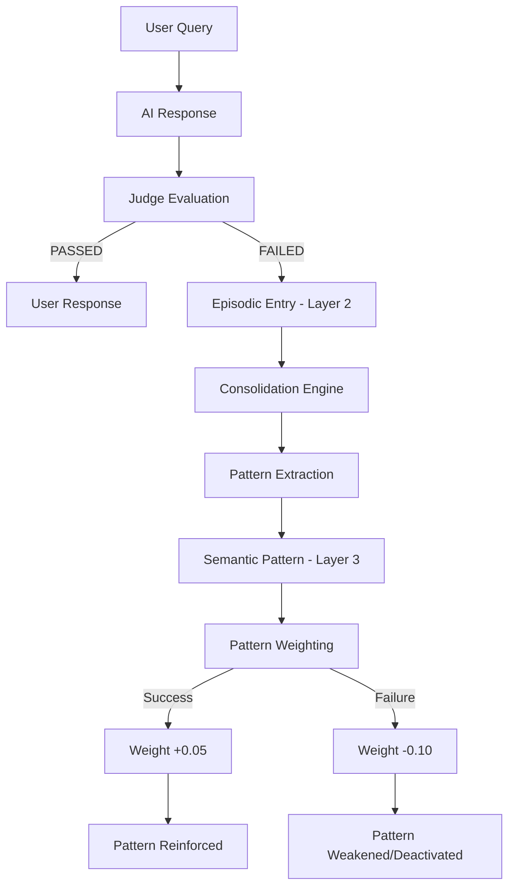

# 🛡️ PersonaVault

**PersonaVault** is a **self-improving cognitive engine** that learns from every interaction, reinforces successful reasoning patterns, and evolves autonomously—all while keeping your data sovereign and private. It's not a memory store; it's a **Memory Operating System (Memory OS)** for AI.

## 🏆 **Why PersonaVault is Different**

| Feature | Others | PersonaVault |
|---------|--------|--------------|
| **Memory Storage** | ✅ | ✅ |
| **Vector Search** | ✅ | ✅ |
| **Self-Improvement** | ❌ | ✅ |
| **Pattern Reinforcement** | ❌ | ✅ |
| **Local-First Sovereignty** | ⚠️ | ✅ |
| **Explainable HITL** | ❌ | ✅ |
| **Cognitive Blackboard** | ❌ | ✅ |

> **"PersonaVault is the first production implementation of a self-improving cognitive engine. The code is free, but the patterns are yours."**

---

## 🧠 The Self-Improving Cognitive Engine

### Three-Layer Memory Architecture

| Layer | What It Stores | How It Changes |
|-------|---------------|----------------|
| **Layer 1: Working (Gas)** | Current context, IoT data | High entropy, transient, volatile |
| **Layer 2: Episodic (Liquid)** | Interaction history, evaluation logs | Fluid, structured logs, flows into patterns |
| **Layer 3: Semantic (Ice)** | Reinforced patterns, user persona | Low entropy, crystalline, **weight-based growth** |

*The system acts as a "Crystallization Engine," reducing information entropy over time.*

### The Reinforced Learning Loop



## 🚀 Key Features

*   **Hybrid Retrieval**: Seamlessly combines Vector Search (FAISS), Relational Traversal (Neo4j), and Keyword Matching (BM25).
*   **Tiered AI Generation**: Prioritizes local LLMs (Ollama) for privacy and speed, with fallback to frontier models (Gemini) for complex tasks.
*   **Cognitive Grounding**: Automatically adjusts AI tone and facts based on real-time IoT data and analyzed user personas.
*   **Weighted Pattern Reinforcement**: A self-improving mechanism that rewards successful reasoning patterns, proven to reach high confidence (0.90+) autonomously.
*   **Self-Improving Pipeline**: A "Judge" agent evaluates every response; recurring errors are automatically "graduated" into Layer 3 constraints.
*   **Crystallization Engine**: Background task manager for Layer 2 -> Layer 3 memory consolidation.
*   **Swarm Traceability**: Real-time Chain-of-Thought (CoT) graph visualizing multi-agent negotiation paths.
*   **Active Swarm Steering**: Interactive terminal for low-latency human intervention in the cognitive loop.
*   **Explainable HITL**: Human-in-the-loop safety gates with raw state inspection and AI-synthesized cognitive insights.
*   **Admin Simulation Lab**: Built-in IoT telemetry generator for testing real-time monitoring and HITL triggers.

## 🧠 Theoretical Validation: The Agent Harness Framework

PersonaVault implements and extends the **MemoHarness framework** (Huang et al., 2026), a research-backed approach to optimizing the "agent harness"—the control layer that turns a base LLM into an executable agent.

### The Six Dimensions of Harness Optimization

| Dimension | MemoHarness Definition | PersonaVault Implementation |
|-----------|----------------------|----------------------------|
| **D1: Context Assembly** | Builds model input from instructions, constraints, and retrieved material | **Working Memory (Layer 1)** + PlannerAgent |
| **D2: Tool Interaction** | Controls when and how the harness calls external tools or retrievers | **IoTService** + MCP Integration |
| **D3: Generation Control** | Sets sampling and budget parameters for model generation | **GeneratorAgent** + AIRouter |
| **D4: Orchestration** | Chooses sequence of model calls and intermediate reasoning steps | **MultiAgentOrchestrator** (11 specialized agents) |
| **D5: Memory Management** | Determines what state persists across calls and what is removed | **3-Layer Memory** (Gas → Liquid → Ice) |
| **D6: Output Processing** | Transforms raw model output into the final answer | **JudgeAgent** + ValidatorAgent |

### Beyond the Framework: PersonaVault Extensions

PersonaVault goes beyond the MemoHarness proposal by adding:

| Extension | Implementation | Value |
|-----------|---------------|-------|
| **Continuous Runtime Learning** | Consolidation Task (Layer 2 → Layer 3) | Self-improves without retraining |
| **Emotional Intelligence** | EmpathyAgent | Human-aligned responses |
| **Human-in-the-Loop** | ApprovalService + HITL Workflow | Enterprise-grade governance |
| **Active Steering** | Interactive Swarm Terminal | Real-time human intervention |
| **Model Agnosticism** | AIRouter (Ollama ↔ Gemini ↔ Custom) | No vendor lock-in |
| **Local-First Sovereignty** | SQLite + Local Inference | Privacy and data control |

> **"MemoHarness demonstrates that optimizing the control layer around an LLM can improve task success by tens of percentage points. PersonaVault is the first production implementation of this framework, extending it with continuous runtime learning, emotional intelligence, and enterprise-grade governance."**

### Citation

```bibtex
@misc{huang2026memoharness,
      title={MemoHarness: Agent Harnesses That Learn from Experience}, 
      author={Yue Huang and Wenjie Wang and Han Bao and Yuchen Ma and Xiaonan Luo and Yi Nian and Haomin Zhuang and Zheyuan Liu and Yue Zhao and Xiangliang Zhang},
      year={2026},
      eprint={2607.14159},
      archivePrefix={arXiv},
      primaryClass={cs.AI},
      url={https://arxiv.org/abs/2607.14159},
}
```

## 🧠 Theoretical Validation: Multi-Agent Orchestration

PersonaVault implements and extends principles from **SwarmResearch** (Virk et al., 2026), an orchestrator-subagent harness for open-ended discovery.

### SwarmResearch Alignment

| SwarmResearch Concept | PersonaVault Implementation |
|-----------------------|----------------------------|
| **Orchestrator-Subagent Pattern** | MultiAgentOrchestrator + 11 specialized agents |
| **Local Context** | Working Memory (Layer 1) |
| **Global Context** | Semantic Memory (Layer 3) |
| **Branch-based Versioning** | Consolidation Task (L2 → L3) |
| **Explorer Agents** | RetrieverAgent + ReasonerAgent |
| **Optimizer Agents** | GeneratorAgent + JudgeAgent |

### Beyond the Framework

PersonaVault extends SwarmResearch with:
- **Emotional Intelligence**: EmpathyAgent for human-aligned responses
- **Human-in-the-Loop**: ApprovalService + HITL workflow
- **Self-Improvement**: Consolidation + Sublimation tasks
- **Model Agnosticism**: AIRouter for any LLM
- **IoT Integration**: Real-time telemetry processing

## 🛠️ Technical Stack

*   **Backend**: FastAPI (Async Python 3.12)
*   **Database**: SQLite (SQLAlchemy Async), Neo4j (Graph), FAISS (Vector)
*   **AI Integration**: Ollama (Local), Google Gemini (Cloud)
*   **Observability**: Prometheus & Grafana ready metrics

## ☁️ Cloud Shell Development

To test the "local-first" pipeline within Google Cloud Shell:

1.  **Install Prerequisites & Ollama**:
    Google Cloud Shell requires `zstd` for extraction. Install it first:
    ```bash
    sudo apt-get update && sudo apt-get install -y zstd
    curl -fsSL https://ollama.com/install.sh | sh
    ```
2.  **Start Ollama Server**:
    Open a separate terminal and run: `ollama serve`
3.  **Pull Lightweight Model**:
    (Cloud Shell is CPU-only with limited RAM; use small models for testing)
    ```bash
    ollama pull tinydolphin
    ```
4.  **Configuration**: Ensure `OLLAMA_URL` in your environment is set to `http://localhost:11434`.

## 🛡️ Administrative Control

Access the system dashboard at `http://localhost:8000/admin/dashboard` to monitor:
*   Neural Memory health and fading rates.
*   Active AI Engine configuration and health.
*   Real-time IoT data ingest and simulated telemetry control.
*   Live system logs and model lifecycle management (Pull/Delete).

## 🔒 Privacy & Security

*   **Transient Tokenization**: PII is tokenized before leaving the secure environment.
*   **Encrypted Storage**: Sensitive memory content is encrypted at rest using Fernet (AES-128).
*   **Local-First**: The pipeline defaults to local inference to ensure personal data stays on-premise whenever possible.

---
*Developed with high-speed "Leapfrog" methodology for next-generation AI agency.*