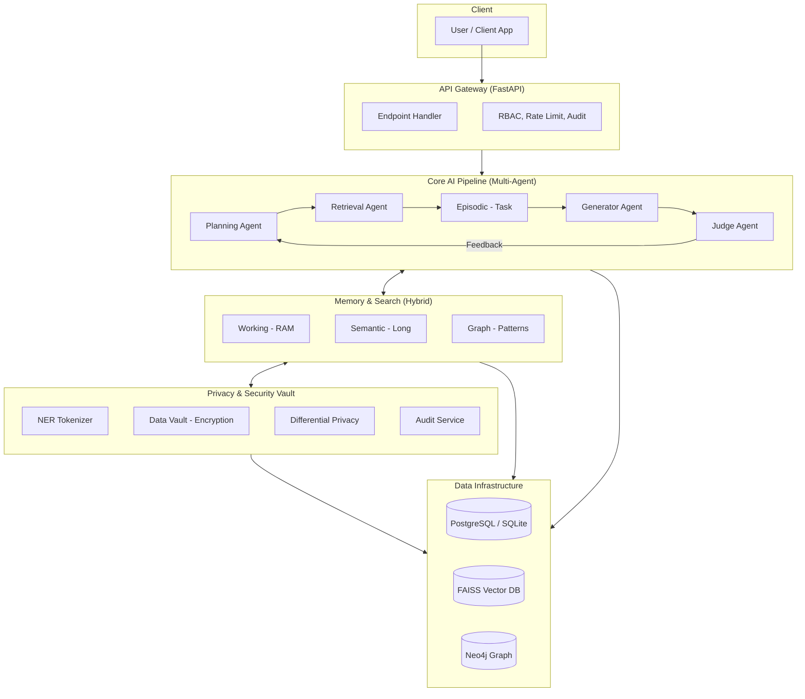

# PersonaVault: The Cognitive Infrastructure for AI Memory

## I. Executive Summary

### Vision
PersonaVault is a privacy-preserving, self-improving AI memory system that serves as the cognitive infrastructure for personal and organizational intelligence.

### Mission
To provide the only AI memory system that learns from every interaction, preserves absolute data sovereignty, and intelligently routes queries to the right intelligence—local or global.

### Core Value Proposition
- **Self-Improving**: Gets smarter with every interaction through a closed-loop "Judge-Generator" feedback cycle.
- **Privacy-First**: Implements a "local-first" data policy where sensitive data is masked or encrypted before reaching external models.
- **Universal Intelligence**: A vendor-agnostic router that balances cost, complexity, and privacy by choosing between local models (Ollama) and frontier models (GPT-4/Claude).
- **Enterprise-Ready**: Built-in RBAC, comprehensive audit logging, and organizational isolation.

---

## II. System Architecture

### Overview
PersonaVault is built on a microservices architecture organized into four primary layers:

1. **Core AI Pipeline**: A self-improving multi-agent system (Planning, Retrieval, Generation, and Judgment).
2. **Memory & Search Layer**: A hierarchical storage system using Hybrid Search (FAISS + BM25 + Neo4j).
3. **Privacy & Security Layer**: The "Vault" logic handling Fernet encryption, entity-level tokenization, and differential privacy.
4. **Domain Integration Layer**: Specialized modules for LegalTech, Robotics (Grounded Perception), and IoT health data.

### Architecture Diagram


---

## III. API Specification

### 1. Authentication

#### POST /auth/login
Create transient sessions.

**Request Body**
```json
{
  "username": "string",
  "password": "string"
}
```
**Response (200 OK)**
```json
{
  "message": "Login successful",
  "session_id": "uuid",
  "expires_at": "ISO8601 timestamp"
}
```

### 2. Memory Management

#### POST /memory/
Create a new memory.

**Request Headers**
| Header | Required | Description |
|--------|----------|-------------|
| `Cookie: session_id={token}` | Yes | Session token from `/auth/login` |
| `X-API-Key: {key}` | Optional | For service-to-service auth |

**Request Body**
```json
{
  "title": "string (1-255 chars)",
  "content": "string (required, max 10,000 chars)",
  "tags": "string (optional, comma-separated)",
  "expiry_days": "integer (optional, default: 0, 0=never)",
  "modality": "enum (optional, default: text, options: text|image|audio|video)"
}
```
**Response (201 Created)**
```json
{
  "id": 123,
  "message": "Memory created successfully",
  "created_at": "ISO8601 timestamp"
}
```

#### GET /api/v1/memory/search
Hybrid search utilizing semantic similarity and keyword matching.

**Query Parameters**
- `query` (string, required): The search term.
- `limit` (int, default: 10): Max results.

**Response (200 OK)**
```json
{
  "results": [
    {
      "id": 123,
      "title": "Meeting Notes",
      "content": "...",
      "score": 0.98
    }
  ]
}
```

### 3. AI & Routing

#### POST /api/v1/ollama/generate
Route a query to the appropriate AI model based on complexity and privacy needs.

**Request Body**
```json
{
  "query": "string",
  "complexity_score": 0.5,
  "sensitivity_level": "medium"
}
```
**Response (200 OK)**
```json
{
  "response": "Synthesized answer...",
  "provider": "ollama|openai|anthropic",
  "tier": "local|standard|enterprise",
  "cost": 0.001
}
```

### 4. System Administration

#### GET /api/v1/admin/dashboard/metrics
Retrieve real-time cognitive and system health metrics.

#### POST /api/v1/admin/dashboard/system/simulate-iot
Toggle the high-frequency IoT telemetry simulation.

---

## IV. WebSocket API

### Connection
```javascript
const ws = new WebSocket('ws://localhost:8000/ws/{user_id}');
```

### Event Types
| Type | Direction | Description |
|------|-----------|-------------|
| `query` | Client → Server | Send a query to the AI agent |
| `response` | Server → Client | AI response stream or complete answer |
| `memory_update` | Server → Client | Real-time notification of new memory ingestion |
| `alert` | Server → Client | Real-time IoT or medical threshold alerts |
| `status` | Server → Client | Pipeline progress updates (e.g., "Retrieving...") |

---

## V. Rate Limiting

### Limits
| Tier | Requests per Minute | Burst |
|------|---------------------|-------|
| Free | 60 | 10 |
| Pro | 300 | 50 |
| Enterprise | Custom | Custom |

### Headers
| Header | Description |
|--------|-------------|
| `X-RateLimit-Limit` | Maximum requests per window |
| `X-RateLimit-Remaining` | Remaining requests in window |
| `X-RateLimit-Reset` | Time when limit resets (Unix timestamp) |

---

## VI. Error Handling

### Error Response Format
```json
{
  "detail": "Human-readable error message",
  "code": "ERROR_CODE",
  "path": "/api/memory",
  "timestamp": "2026-07-04T14:30:00Z",
  "request_id": "req_123456"
}
```

### Common Error Codes
| Code | Description |
|------|-------------|
| `AUTH_001` | Invalid credentials or session expired |
| `PERM_001` | Missing permission (RBAC) |
| `RATE_001` | Rate limit exceeded |
| `VALID_001` | Invalid input or schema violation |
| `SERV_001` | Internal pipeline failure |

---

## VII. Data Schema

PersonaVault utilizes a relational backbone with specialized JSON extensions for multi-modal and cognitive metadata.

### Core Entities
- **Users**: Stores identity, `password_hash`, `role`, and `permissions` (JSON).
- **Memories**: The primary store for content, `modality`, `tags`, and `expiry_days`.
- **UserPersonas**: Tracks cognitive styles (writing/communication) to personalize AI responses.

### AI & Learning
- **EpisodicEntry**: Logs of every RAG interaction including `query`, `plan`, `results`, `evaluation`, and `hitl_approved` status.
- **SemanticPattern**: Graduated long-term knowledge, including `trigger`, `correction`, `weight`, and `success_count` for reinforcement learning.

### Security & Compliance
- **AuditLog**: Unified system event log (IP, User Agent, Action, Status).
- **PrivacyAuditLog**: Specialized audit for privacy operations (Masking/Encryption/DP).
- **PendingAction**: Queue for Human-in-the-loop (HITL) orchestration, storing `agent_type`, `query`, resolution `options`, and lifecycle `status`.

### Domain Specific
- **IoTData / IoTDevices**: Stores time-series telemetry keyed by unique `device_id`.
- **LegalDocuments**: Content with `privilege_level` and metadata for Attorney-Client privilege.

### Pattern Reinforcement Engine

| Component | Function | Current Status |
|-----------|----------|----------------|
| **Judge Agent** | Evaluates every response for faithfulness, coverage, relevance | ✅ Active |
| **Consolidation Service** | Extracts corrective patterns from failures | ✅ Active |
| **Pattern Weighting** | +0.05 per success, -0.10 per failure | ✅ Active |
| **Threshold Deactivation** | Auto-disable patterns below 0.40 weight | 🔜 Planned |
| **Reinforcement Decay** | Decay unused patterns | 🔜 Planned |

**Current Metrics:**
- Patterns Created: 10
- Pattern #1 Weight: 0.90
- Successes Recorded: 7
- Success Rate: 100% (10/10 patterns > 0.80)

---

## VIII. Security & Privacy Architecture

PersonaVault is built on the principle of **Zero-Knowledge Knowledge Management**.

### 1. Data Masking (NER Tokenization)
Before a query leaves the local environment for a Cloud LLM (GPT-4, etc.), the `TokenizationService` identifies PII (Emails, Phones, IPs) using entity patterns and replaces them with transient `PV_TOKEN`s. Mapping is stored only in the local memory.

### 2. Data Encryption (Vault)
Sensitive fields in the database are encrypted using `Fernet` (AES-128 in CBC mode). User keys are derived from a combination of the Master Key and the user's secret, ensuring the database administrator cannot read raw memory content.

### 3. Differential Privacy
Numerical telemetry (e.g., medical data) is privatized using Laplace noise injection via the `DifferentialPrivacyService` before being used in aggregated global patterns.

### 4. Living Memory Concept
The `expiry_days` column combined with the `cleanup_job` background task allows data to naturally "fade" from the system, reducing the data liability footprint for both users and enterprises.

---

## IX. Integration Guide

### Authentication Flow (CLI)
```bash
curl -X POST https://api.personavault.com/auth/login \
  -H "Content-Type: application/json" \
  -d '{"username":"user","password":"SecurePass123!"}' \
  -c cookies.txt
```

### Python SDK Usage
```python
from personavault import PersonaVault

client = PersonaVault(api_key="pv_123...", base_url="https://api.personavault.com")

# Search personal memory
results = client.search("What did I discuss with the legal team?")
```

---

## X. Testing Strategy

### Test Coverage Targets
| Area | Target |
|------|--------|
| **Core Pipeline** | ≥ 95% |
| **API Endpoints** | ≥ 90% |
| **Privacy Vault** | ≥ 100% |

### Execution
```bash
pytest tests/unit/          # Component isolation
pytest tests/integration/   # Database and Search interactions
pytest --cov=backend        # Coverage analysis
```

---

## XI. Performance Metrics

| Metric | Target | Current |
|--------|--------|---------|
| Memory Creation | < 50ms | ✅ |
| Memory Search | < 150ms | ✅ |
| Timeline Creation | < 500ms | ✅ |
| Replay Analysis | < 500ms | ✅ |
| Trend Analysis | < 1s | ✅ |
| Pattern Verification | < 100ms | ✅ |
| Consolidation (Batch) | < 5s | ✅ |
| AI Chat (Local) | < 2s | ✅ |

## XII. Business Model

### Pricing Tiers
| Tier | Price | Features |
|------|-------|----------|
| **Free** | $0 | Local-only storage, 1,000 memories, basic search |
| **Pro** | $20/mo | Cloud sync, 10,000 memories, AI Router, Email support |
| **Enterprise** | Custom | Unlimited storage, custom RBAC, Audit logs, 24/7 SLA, **self-improving patterns** |


## XIII. Competitive Analysis

| Competitor | Our Advantage |
|------------|---------------|
| **OpenAI** | Privacy-preserving memory; data never leaves local env raw |
| **Mem0** | End-to-end encryption; Living Memory (auto-expiry); **Reinforcement learning** |
| **LangChain** | Highly integrated agentic loop; self-improving judge cycle; **Pattern weighting** |
| **Letta** | Cognitive architecture; **Explainable HITL** |
| **Zep** | Vector search; **Weighted pattern reinforcement** |

### The "Compounding Advantage" Moat


**What can't be copied:**
- Your patterns and their weights (7 successes recorded)
- Your reinforcement history (Pattern #1 at 0.90)
- Your cognitive evolution (4 patterns, growing)


## XIV. User Guide

### Getting Started
1. **Account Setup**: Register via the portal and configure your local Ollama instance for maximum privacy.
2. **Data Ingestion**: Use the browser extension or API to log memories, meeting notes, and IoT telemetry.
3. **Querying**: Ask natural language questions. PersonaVault will decide whether to answer locally or via a cloud expert.
4. **Privacy Control**: Manage your "Vault" to see how PII is being masked before processing.
5. **Reinforcement**: The system learns from every interaction. Patterns are automatically extracted and weighted.


## XV. Deployment & Operations

### Infrastructure
- **Containerization**: Standardized Docker images for development and production.
- **Orchestration**: Kubernetes-ready with `liveness` and `readiness` probes.
- **Database Strategy**: 
    - **Current (Dev)**: Converged **SQLite** (Cloud Shell) or **PostgreSQL** simulating Vector and Graph capabilities to reduce complexity during the build.
    - **Future (Production Scale)**: Decoupled architecture:
        - **PostgreSQL** for relational data.
        - **Weaviate** for high-scale vector retrieval.
        - **Neo4j** for native semantic graph traversal.

### Connectivity Modes
The system is designed with a "Special Setting" for migration and data sovereignty:
*   **Air-Gapped (Local-First)**: Direct connection to user-owned local database instances.
*   **Cloud-Hybrid**: Utilizing online database service free tiers for scalability.


### Configuration (Environment Variables)
| Variable | Default | Description |
|----------|---------|-------------|
| `DATABASE_URL` | `sqlite:///./pv.db` | Persistence layer connection string |
| `SECRET_KEY` | `change-me` | Key for JWT and session signing |
| `OLLAMA_URL` | `http://localhost:11434` | Endpoint for local model inference |
| `ENCRYPTION_KEY` | `required` | 32-byte key for the Privacy Vault |
| `PATTERN_THRESHOLD` | `0.40` | Minimum weight for active patterns |
| `REINFORCEMENT_INCREMENT` | `0.05` | Weight increase per success |
| `REINFORCEMENT_DECREMENT` | `0.10` | Weight decrease per failure |

### Monitoring & Observability
- **Pattern Dashboard**: Real-time view of pattern weights and success rates.


## XVI. Roadmap

### Q3 2026: Foundation Complete ✅ (DONE)
- [x] Self-improving multi-agent pipeline.
- [x] **Reinforcement Learning Loop** (Pattern #1 at 0.90 weight).
- [x] **Pattern Management API** (Verification endpoint).
- [x] **Cognitive Blackboard** (Agent collaboration).

### Q4 2026: Multi-Modal & Advanced Reinforcement
- [ ] **Threshold-Based Deactivation**: Auto-disable patterns below 0.40 weight.
- [ ] **Reinforcement Decay**: Decay unused patterns.
- [ ] **Pattern Marketplace**: Share anonymized patterns.

### Q1 2027: Federated Personalization
- [ ] Federated learning to aggregate patterns without sharing raw data.
- [ ] Marketplace for "Cognitive Skillsets" (Pre-trained legal/medical patterns).
- [ ] Homomorphic search on fully encrypted data clusters.

---

## XVII. Decision Intelligence API

### Decision Timeline

#### GET /api/v1/timeline/{event_id}
Get the full decision timeline for an event.

**Response:**
```json
{
  "event_id": 1,
  "event_type": "incident_response",
  "decision": "escalated",
  "timeline": [
    {
      "step": 1,
      "type": "detection",
      "label": "Event Detected",
      "description": "Security incident detected",
      "confidence": 0.91,
      "actor": "soc_analyst",
      "timestamp": "2026-07-28T07:15:37.166800"
    },
    {
      "step": 2,
      "type": "policy_match",
      "label": "Policy Matched",
      "description": "Matched 1 policies",
      "policies": ["High Risk Escalation"]
    },
    {
      "step": 3,
      "type": "ai_recommendation",
      "label": "AI Recommendation",
      "description": "AI recommended escalated with 91% confidence",
      "confidence": 0.91,
      "decision": "escalated"
    },
    {
      "step": 4,
      "type": "decision",
      "label": "Decision Made",
      "description": "Decision: escalated",
      "reason": "Phishing attempt detected",
      "actor": "soc_analyst",
      "outcome": "success"
    },
    {
      "step": 5,
      "type": "audit",
      "label": "Audit Logged",
      "description": "Audit ID: audit-xxx",
      "audit_id": "audit-xxx"
    }
  ]
}
```

### Decision Replay

#### GET /api/v1/timeline/replay/{event_id}
Replay a decision at a specific point in time.

**Response:**
```json
{
  "event_id": 1,
  "original_decision": {
    "decision": "escalated",
    "confidence": 0.91,
    "reason": "Phishing attempt detected"
  },
  "analysis": {
    "would_decision_change": false,
    "policies_at_time": ["High Risk Escalation"]
  }
}
```

### Trend Analysis

#### GET /api/v1/timeline/trends/{event_type}
Get decision trends for an event type.

**Response:**
```json
{
  "event_type": "incident_response",
  "period_days": 30,
  "total_events": 54,
  "average_confidence": 0.908,
  "trend": "improving",
  "decision_distribution": { "escalated": 54 },
  "outcome_distribution": { "success": 54, "failure": 0 }
}
```

---

## XVIII. Performance Metrics

| Metric | Target | Current |
|--------|--------|---------|
| Memory Creation | < 50ms | ✅ |
| Memory Search | < 150ms | ✅ |
| Timeline Creation | < 500ms | ✅ |
| Replay Analysis | < 500ms | ✅ |
| Trend Analysis | < 1s | ✅ |
| Pattern Verification | < 100ms | ✅ |
| Consolidation (Batch) | < 5s | ✅ |
| AI Chat (Local) | < 2s | ✅ |

---

## XIX. Robotics Intelligence API

### Robot Decision

#### POST /api/v1/behaviour/event
Create a robot decision event. (See v2.0 behaviour event schema)

*Last Updated: July 2026*
```
