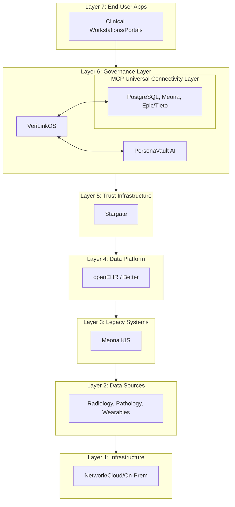

# USB Demo Documentation: VeriLinkOS + PersonaVault

## I. VeriLinkOS + PersonaVault in USB's Architecture

This documentation outlines how the VeriLinkOS + PersonaVault fusion platform acts as a vendor-neutral governance layer atop USB’s data platforms.

## II. Why This Architecture Matters for USB

| USB Need | Fusion Platform Delivery |
|----------|---------------------|
| **Data Sovereignty** | USB retains control of data, whether stored in openEHR or Epic |
| **Sovereign AI Control** | USB retains ownership of AI models, reinforcement patterns, and governance constitution |
| **Vendor-Neutral Future** | Change KIS without rebuilding governance |
| **Crypto-Proof Compliance** | Every AI decision is independently verifiable |
| **Safe Autonomy** | AI agents operate with trust and verification |

*Note: The platform directly addresses the pervasive "Shadow AI" problem—where clinical staff use unapproved AI tools—by bringing all AI interactions into a governed, safe, and auditable environment.*

...

## XII. Competitive Landscape

| Dimension | Enterprise Giants | Governance Startups | Fusion Platform |
|-----------|------------------|---------------------|-----------------|
| **Enforcement** | Reactive Guardrails | Policy Dashboards Only | **Active/Real-time** |
| **Intelligence** | Model Observability | Compliance Reporting | **Self-Improving AI** |
| **Evidence** | Audit Logs (Mutable) | No | **Cryptographic Proof** |
| **Neutrality** | Vendor-Locked | Vendor-Specific | **Vendor-Neutral (MCP)** |

...

## XV. Quick Wins for USB (First 30 Days)

> *Strategic Note on TCO/Risk Avoidance:* By selecting the Fusion platform, USB mitigates the "vendor lock-in" risk associated with a CHF 100M+ KIS decision. It provides a sovereign buffer, proving safe AI adoption is possible without a monolithic KIS. This approach represents significant immediate CAPEX and long-term OPEX savings.

- **Week 1**: Deploy MCP connectivity to openEHR, begin auditing AI governance logs.
- **Week 2**: Issue first VAP Receipts for a low-risk clinical AI pilot (e.g., radiology triage).
- **Week 3**: Configure HITL Queue for a clinical workflow, demonstrate cryptographic proof.
- **Week 4**: Generate compliance report mapping to EU AI Act & nDSG, ready for regulator review.



## IV. The Fusion Advantage: Defining "Active Governance"

In our architecture, **Governance** is not a static policy document. It is an **Active Governance Layer** defined by three technical pillars:

1.  **Automated Enforcement (VeriLinkOS):** Real-time gatekeeping of AI actions against clinical protocols.
2.  **Cryptographic Evidence (VAP Receipts):** Irrefutable proof of *why* an AI decision was made, linked to the specific protocol and patient state at the time of decision.
3.  **Algorithmic Improvement (PersonaVault):** A closed-loop system where governance outcomes (e.g., successful triage) automatically inform and tighten future policy.

**The Governance Loop:**
`Policy (Config) → Enforcement (VeriLinkOS) → Evidence (VAP Receipts) → Learning (PersonaVault) → Refined Policy`

Together, these pillars create a self-improving, auditable, and entirely USB-controlled governance system.

## V. The Learning Edge: Intelligence that Evolves

PersonaVault learns from every interaction, transforming USB’s clinical practice into institutional knowledge.

| Stakeholder | Goal | What PersonaVault Learns |
| :--- | :--- | :--- |
| **CIO** | System-wide ROI | **Adoption Drift**: Which AI tools deliver value vs. shadow work? |
| **Clinician** | Better Outcomes | **"Best Practice" Workflows**: Which interactions lead to faster decisions? |
| **Compliance** | EU AI Act/nDSG | **HITL Integrity**: Is human oversight meaningful or rubber-stamping? |
| **IT/Data** | Interoperability | **Decision Clashes**: When do Radiology/Cardiology AI disagree? |

**Strategic Benefit:** You don't just enforce policy; you refine it based on real-world clinical performance.

## VI. Strategic Pivot: Aligning with the KIS Decision

Our architecture is designed to be successful regardless of whether USB proceeds with a proprietary KIS (like Epic) or a modular, openEHR-centric approach.

### Scenario A: Modular/openEHR Preference
**The Pitch:** Fusion is the **essential governance layer** that makes the modular openEHR strategy functional and secure. It provides the proof of compliance and intelligence that a raw openEHR platform lacks, effectively transforming data storage into an intelligent ecosystem.

### Scenario B: Proprietary KIS (e.g., Epic) Deployment
**The Pitch:** Fusion is the **essential safeguard and integration layer** for the Epic deployment. It mitigates vendor lock-in by enforcing governance, ensuring cryptographic proof of AI decisions, and managing interoperability within the regional health network, acting as the "sovereign buffer" that ensures USB remains in control.

## VII. How the Fusion Platform Connects to Each Layer

- **Data Platform (openEHR):** VeriLinkOS acts as an **MCP Client** to query clinical audit trails and provenance data via SQL, while PersonaVault provides semantic context.
- **Trust Infrastructure (Stargate):** Native integration. VeriLinkOS utilizes Ed25519 signatures (compatible with KERI/DKMS) and ACDC-compatible VAP Receipts.
- **Legacy Systems (Meona):** VeriLinkOS acts as an MCP Client, providing governance continuity during phased retirement.
- **Future Systems (Epic/Tieto):** Vendor-neutral governance via MCP. The platform remains unchanged regardless of KIS choice.
- **AI Tools (TotalSegmentator):** VeriLinkOS adds cryptographic proof and policy enforcement (Guardian) when research AI tools are used in clinical contexts.
- **Wearables/IoT:** IoT/Telemetry Governance module audits data flows and AI-generated alerts.

## VIII. Domain Governance Templates (Configuration over Creation)

Rather than hard-coding AI models into domain-specific packs, the Fusion platform uses **Domain Governance Templates**. This allows USB to support any clinical domain (Radiology, Cardiology, Oncology) in hours by configuring the governance engine.

### Example: Clinical Governance Template (Radiology)

```yaml
# Clinical Governance Template: Radiology
pack:
  name: Clinical Decision Support
  domain: radiology
  governance_rules:
    - rule: check_clinical_guideline_match
      action: block_if_mismatch
    - rule: require_hitl_for_high_risk
      action: trigger_hitl_queue
  evidence: VAP_RECEIPT_ENABLED
```

**Why this strategy works for USB:**
- **Agility:** Support new domains (e.g., Pharmacy, Oncology) by simply updating the template.
- **Centralization:** Manage governance for 20+ domains from one unified platform.
- **Vendor-Neutrality:** The governance engine doesn't change when you switch KIS (e.g., Epic vs. Tieto).

## IX. The Strategic Hybrid Strategy: Epic + openEHR

In the hybrid scenario, openEHR acts as the critical "data buffer" preventing vendor lock-in. The Fusion platform complements this strategy:

| Fusion Component | Role in Hybrid Architecture |
|------------------|-----------------------------|
| **VeriLinkOS** | Enforces governance across both Epic and openEHR; provides VAP Receipts for AI decisions in either system |
| **PersonaVault** | Delivers decision intelligence across the entire patient journey |
| **MCP Connectivity** | Connects to Epic's FHIR APIs and openEHR's AQL queries simultaneously |
| **VAP Receipts** | Cryptographic proof valid regardless of system migration |

## X. Sovereign & Vendor-Neutral by Design

| Design Principle | Fusion Platform Delivery |
|------------------|---------------------|
| **USB Owns Intelligence** | USB manages its own Local Guardian Constitution, learned patterns, and audit trails. The platform is infrastructure; the intelligence belongs to USB. |
| **Sovereign AI Control** | USB retains full authority over AI behavior, policy evolution, and decision intelligence. |
| **Model Agnostic** | Supports local models (Ollama), secure routing to frontier models (GPT-4/Claude), or custom clinical models via MCP. |
| **MCP Connectivity** | Connects to any system (openEHR, Epic, Meona, Stargate). |
| **Sovereign Data** | USB controls keys, data, and infrastructure. |
| **No Lock-in** | AI receipts remain independently verifiable, regardless of infrastructure changes. |

## XI. openEHR Data Platform + Fusion Integration

openEHR provides the semantically-rich data layer. Fusion fills the governance gap:

| What openEHR Does | What Fusion Adds |
|-------------------|------------------|
| Persistent clinical data | AI Governance & Active Enforcement |
| Versioned clinical audit trail | Cryptographic proof (VAP Receipts) |
| Semantic interoperability | Decision intelligence & explainability |

## XII. Competitive Landscape

| Dimension | Enterprise Giants | Governance Startups | Fusion Platform |
|-----------|------------------|---------------------|-----------------|
| **Enforcement** | Reactive Guardrails | Policy Dashboards Only | **Active/Real-time** |
| **Intelligence** | Model Observability | Compliance Reporting | **Full Swarm/Learning** |
| **Evidence** | Audit Logs (Mutable) | No | **Cryptographic Proof** |
| **Neutrality** | Vendor-Locked | Vendor-Specific | **Vendor-Neutral (MCP)** |

## XIII. Regulatory Compliance & Sovereignty Mapping

Our architecture is built for strict adherence to European and Swiss regulations, ensuring USB maintains full legal and technical sovereignty over its data and AI decisions.

| Regulatory Requirement | Fusion Architectural Solution |
|-------------------------|------------------------------|
| **EU AI Act - Art 14 (Human Oversight)** | **Human-in-the-Loop (HITL) Queue:** Mandatory verification for Tier 3 risk decisions, enforced before action is taken. |
| **EU AI Act - Art 12 (Logging/Traceability)** | **VAP Receipts:** Immutable cryptographic audit trail of every AI decision, request context, and human intervention. |
| **EU AI Act - Art 9 (Risk Management)** | **Guardian Circuit Breaker:** Real-time monitoring of AI confidence scores; automatically blocks decisions below risk thresholds. |
| **Swiss nDSG/FDPIC (Data Protection)** | **On-Premise Sovereignty:** Fusion is designed for on-premise/private cloud deployment. Data never leaves USB control to interact with AI. |
| **GDPR (Data Minimization/Sovereignty)** | **PII Masking & Local-First Processing:** Sensitive data is masked before interaction with external/LLM models. All model learning happens locally within PersonaVault. |

**The Sovereignty Core:**
Because Fusion operates on-premise and provides cryptographic evidence of all AI processes, USB meets the "Explainability" and "Accountability" mandates of the EU AI Act and Swiss law by design, not just by policy. The platform allows USB to act as its own "Authorized Representative" under the EU AI Act, maintaining full authority over AI behavior.

## XIV. With Fusion vs. Without Fusion

| With Fusion | Without Fusion |
|-------------|----------------|
| ✅ Safe, auditable AI adoption | ❌ Shadow AI, risks |
| ✅ Cryptographic proof of every decision | ❌ No audit trail |
| ✅ 95%+ human oversight | ❌ Unmonitored AI |
| ✅ Automated regulatory compliance | ❌ Manual reporting |
| ✅ Self-improving governance | ❌ Static policies |
| ✅ Sovereign data (on-premise) | ❌ Data sovereignty risk |
| ✅ Vendor-neutral (Epic/Tieto) | ❌ Vendor lock-in |
| ✅ Patient trust (verifiable) | ❌ Trust-based only |

## XV. Quick Wins for USB (First 30 Days)
- **Week 1**: Deploy MCP connectivity to openEHR, begin auditing AI governance logs.
- **Week 2**: Issue first VAP Receipts for a low-risk clinical AI pilot (e.g., radiology triage).
- **Week 3**: Configure HITL Queue for a clinical workflow, demonstrate cryptographic proof.
- **Week 4**: Generate compliance report mapping to EU AI Act & nDSG, ready for regulator review.

## XVI. Strategic One-Liner for Marc Strasser

> *"We provide the vendor-neutral governance layer for everything that touches your clinical data. You own the intelligence, you control the models, and you govern the outcomes. Whether you choose Epic, Tieto, or openEHR, we connect via MCP to provide cryptographic proof that every AI decision is safe, compliant, and auditable."*
