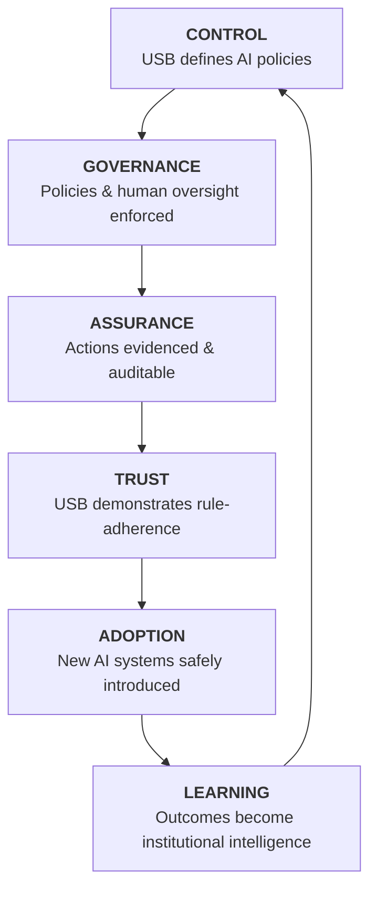

# USB Demo Documentation: Trusted Control Plane for Clinical AI

## I. Executive Proposition: Retaining Control in an AI-Driven World

As USB embarks on a major KIS/data-platform decision (Epic, Tieto, openEHR), AI is simultaneously becoming embedded across clinical workflows. The central strategic risk is that AI governance becomes fragmented within different KIS vendors or disparate AI applications, leading to **vendor lock-in, shadow AI, and inconsistent clinical policy.**

The Fusion Platform (VeriLinkOS + PersonaVault) provides **USB’s independent AI Control Plane**. It is not another KIS or data repository; it is the infrastructure layer that makes it possible for USB to safely authorize and manage an entire ecosystem of AI capabilities.

**The core strategic proposition:** Regardless of the KIS choice, USB retains full authority over its clinical AI policy, evidence, and intelligence. **The control layer is the constant; the AI systems and KIS components are interchangeable.**

---

## II. The Strategic Value: Creating USB's AI Trust Layer

AI capabilities will continue to emerge faster than USB can predict which systems will become clinically valuable. The strategic challenge is not choosing the right AI today; it is creating the capability to evaluate, govern, assure, and safely adopt whatever AI becomes valuable tomorrow.

Fusion establishes this permanent control layer. It separates **AI innovation from AI authority**: expert systems can evolve, models can change, and vendors can come and go, while USB retains control over policy, access, evidence, human oversight, and accountability.

**The result is not simply governed AI; it is an environment in which USB can confidently and safely adopt more AI, faster.**

---

## III. The USB AI Trust Flywheel

USB's strategic advantage is generated by the continuous operation of the AI Trust Flywheel:

---

## IV. The Board Perspective: Why Fusion Matters

| Strategic Question | Answer |
| :--- | :--- |
| **Why now?** | Clinical AI is being deployed while USB is making a multi-decade KIS decision. |
| **What do we gain?** | Independent control over AI policy, independent of any KIS/vendor. |
| **What risk is reduced?** | AI risk (Shadow AI), vendor lock-in, compliance exposure, and operational inconsistency. |
| **How do we validate?** | Initiate a 30-day controlled clinical AI pilot on one specific workflow. |

---

## V. The CIO Perspective: Operational Assurance

Fusion operationalizes trust by intercepting, evaluating, and documenting AI actions in real-time.

### The Anatomy of a Transaction (e.g., Radiology AI Triage)

| Step | Action | Fusion Platform Function |
| :--- | :--- | :--- |
| **1. Request** | AI triage request received (Patient, Model, Domain, Action) | Intercepted by Control Plane |
| **2. Guardian Check** | VeriLinkOS checks policy (Is model approved? Is use case appropriate?) | **Active Enforcement** |
| **3. Risk Eval** | Risk tier analysis (Confidence score vs. Protocol threshold) | **Policy Evaluation** |
| **4. Decision** | ALLOW / BLOCK / HITL-ESCALATION | **Operational Gatekeeping** |
| **5. Evidence** | Generate VAP Receipt (Protocol, State, Decision, Signature) | **Cryptographically verifiable evidence** |
| **6. Feedback** | PersonaVault learns from clinical outcome | **Self-Improving Governance** |

*Note: As new AI systems are introduced, their performance and governance outcomes become additional institutional knowledge. The value of the control layer therefore compounds as USB's AI ecosystem grows.*

---

## VI. Future-Proofing: Aligning with the KIS Decision

**The KIS may change. AI models will change. AI vendors will change. The control layer remains USB's.**

*   **Modular/openEHR Preference:** Fusion provides the governance layer that makes the modular strategy functional and secure.
*   **Proprietary KIS (e.g., Epic) Deployment:** Fusion acts as the safeguard and integration layer, mitigating vendor lock-in and providing a sovereign buffer.

| USB Strategic Need | Fusion Platform Delivery |
| :--- | :--- |
| **Data Sovereignty** | USB controls its data, keys, and infrastructure. |
| **AI Sovereignty** | USB retains authority over AI policy, models, and decision authority. |
| **Vendor-Neutral Future** | Change KIS, models, or AI vendors without rebuilding the control layer. |
| **Trust & Assurance** | Evidence of how AI was governed, what happened, and who intervened. |
| **Continuous AI Adoption** | Introduce new AI expert systems within the same trusted control framework. |

---

## VII. Regulatory Compliance Mapping

Our architecture supports adherence to European and Swiss regulations by design, focusing on *operationalized compliance*.

| Compliance Mandate | Fusion Architectural Implementation |
| :--- | :--- |
| **EU AI Act - Art 14 (Human Oversight)** | Mandatory HITL Queue for high-risk decisions, enforced before action. |
| **EU AI Act - Art 12 (Traceability)** | VAP Receipts providing verifiable evidence of every AI decision. |
| **Swiss nDSG / GDPR** | On-premise sovereignty; data is masked before interaction with external models. |

---

## VIII. Strategic One-Liner for the Pitch

> *"We make AI innovation safe to adopt at scale: USB owns the control layer, while AI models, vendors and expert systems can continuously evolve above it. Whether you choose Epic, Tieto, openEHR, or a hybrid architecture, the independent AI control plane remains yours."*

---

## IX. About the Author

**Rajinder Jhol** is the Founder and Lead Architect of the VeriLinkOS and PersonaVault platforms. He has over 15 years of experience in GovTech and enterprise architecture, including work with the Swiss Federal Government, where he specialized in secure, sovereign infrastructure for regulated environments.

His work focuses on bridging the gap between emerging AI capabilities and the governance requirements of highly regulated sectors such as healthcare, finance, and government. He created the Fusion platform to provide organizations with an independent, vendor-neutral control layer for safe and auditable AI adoption.

He holds a deep expertise in:
- Cryptographic governance and verifiable evidence systems
- MCP (Model Context Protocol) and agentic AI architectures
- EU AI Act, Swiss nDSG, and healthcare regulatory compliance
- Sovereign AI and on-premise deployment models
- Decision intelligence and reinforcement learning systems

He can be reached at: **rajinderjhol@gmail.com**
