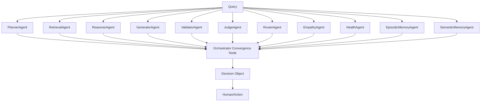

# PersonaVault: A Sovereign Decision Operating System for AI-Human Governance

**Abstract** — Contemporary AI systems are fundamentally model-centric: intelligence is generated by inference engines but remains ephemeral, model-dependent, and opaque. This paper introduces PersonaVault, a model-independent Decision Operating System (DOS) that decouples organisational intelligence from the AI inference engine. PersonaVault introduces the **Decision Object** as a persistent computational primitive—an immutable, evidence-linked record of decision context, policy state, AI reasoning, human intervention, and outcomes. Through a multi-layered memory architecture (Gas → Liquid → Ice), an eleven-agent swarm for specialised reasoning, and an open gateway for multi-model orchestration, PersonaVault enables the accumulation of decision intelligence that persists across model generations. Addressing the critical challenges of the Medical Internet of Things (MIoT), Brain-Computer Interfaces (BCIs), and the evolving regulatory landscape (EU AI Act, Singapore MGF), we formalise the Decision Object and propose a framework for building compliance-by-design, auditable, and sovereign AI systems.

---

## I. Introduction
Current AI deployments embed intelligence within the inference engine, creating a dependency loop where organisational knowledge becomes inseparable from a specific model version. We propose the **Decision Object** as a persistent computational primitive, establishing that while **models generate intelligence, PersonaVault accumulates decision intelligence.**

---

## II. The PersonaVault Operating System Architecture

We define PersonaVault as a **Decision Operating System (DOS)**, mapping classical OS primitives to cognitive functionality:

| OS Primitive | PersonaVault Implementation |
| :--- | :--- |
| **Persistent State** | Decision Object ($D$) |
| **Resource Management**| Service Registry (Model/Memory/Tool Providers) |
| **Isolation** | Execution Modes (Restricted, Standard, Audit) |
| **Permissions** | RBAC Middleware / Local Guardian Constitution |
| **Scheduling** | MultiAgentOrchestrator (Async parallel execution) |
| **Observability** | Cognitive Execution Trace |

---

## III. The Decision Object: A Computational Primitive

We formalise the Decision Object $D$ as an immutable tuple:
$$D = (C, P, A, H, E, O, R)$$
where context $C$, policy state $P$, AI contributions $A$, human interventions $H$, anchored evidence $E$, empirical outcome $O$, and replay metadata $R$.

**Primitive Criteria:**
1. **Canonical Schema**: Structured definition of decision components.
2. **Persistent Identity**: Unique hash-based tracking.
3. **Immutability/Auditability**: Provenance anchored via the Verifiable Action Protocol.
4. **Defined Operations**: $\{\text{Create, Replay, Evaluate, Crystallize}\}$.
5. **Model-Independence**: State is defined externally to inference engines.

---

## IV. System Architecture

### A. Experience-Weighted Institutional Memory
PersonaVault utilizes an adaptive memory mechanism. The crystallisation loop updates pattern weights $w_P \in [0, 1]$ based on empirical outcomes $F \in \{0, 1\}$ (where 1 is success, 0 is failure):
$$w_{P, new} = \text{clamp}(w_P + \eta (F - w_P), 0, 1)$$
This provides a mechanism for increasing the retrieval priority of empirically successful heuristics while suppressing failed patterns.

### B. The Eleven-Agent Swarm
Orchestration converges through a centralized registry ensuring coherence:

### C. Sovereignty in MIoT and BCI Ecosystems
In sensitive fields like MIoT and BCIs, PersonaVault addresses the dangers of centralized trust. Its **Local-First** architecture ensures that sensitive physiological or neural data never leaves the hospital's sovereign environment, mitigating the risk of centralized data breaches [8, 9]. By implementing "Sovereign AI at the Front Door of Care"—utilizing unidirectional data channels and local-first processing—PersonaVault provides a defensible framework for organizations seeking to maintain cultural and data integrity in the digital age [12].

---

## V. Regulatory Governance & Compliance

PersonaVault is designed to operationalise the technical requirements of the emerging AI regulatory landscape.

### A. EU AI Act and GDPR Interplay
The EU AI Act mandates stringent technical documentation and human oversight for high-risk AI [13]. PersonaVault maps directly to these obligations:
1. **Human Oversight**: The Decision Timeline ensures a **Human-in-the-Loop (HITL)** is embedded at decision checkpoints.
2. **Transparency & Explainability**: The **Cognitive Execution Trace** and **Evidence Pipeline** support the "right to explanation" mandated by GDPR and the AI Act.
3. **Data Governance & Minimization**: By treating the Decision Object as an isolated entity, the system supports GDPR’s right-to-erasure and data minimization mandates, allowing for selective pruning of PII from historical traces without compromising institutional knowledge integrity.

### B. Singapore MGF for Agentic AI
PersonaVault supports the four core dimensions of the Singapore MGF [14]:
- **Assess and Bound Risks Upfront**: Agents are bounded by **Execution Modes** (Restricted/Standard/Audit).
- **Make Humans Meaningfully Accountable**: The **Decision Timeline** provides clear points for human intervention.
- **Implement Technical Controls**: **Audit Trails** provide full visibility into agent reasoning.
- **Enable End-User Responsibility**: Explanations generated via the **Evidence Pipeline** clarify *why* an AI agent acted as it did.

---

## VI. Experimental Framework

We propose the following hypotheses to validate the core thesis:

| Hypothesis | Metric | Baseline |
| ---------- | ------------------------------------------------------------------------- | ------------------------- |
| **H1 (Independence)** | Accuracy decay rate after model substitution | Stateless LLM |
| **H2 (Memory)** | Time-to-threshold for decision accuracy | Conventional RAG |
| **H3 (Replay)** | Reconstruction faithfulness score | None (Baseline 0) |
| **H4 (Audit)** | Evidence coverage in decision reconstruction | Conversational Logs |

---

## VII. Discussion & Limitations

### A. Limitations
- **Bootstrapping**: New organisations face the challenge of accumulating sufficient crystallised knowledge.
- **Complexity**: The multi-agent architecture introduces operational complexity.
- **Evidence Quality**: The effectiveness of evidence anchoring depends on the quality of source documentation.

### B. Future Research Directions
- **Cross-Domain Intelligence**: Transferring learning across Intelligence Packs.
- **Formal Verification**: Using the Decision Object for formal verification of AI-assisted decisions.

---

## VIII. References

[1] W. Wei, et al., "Research on the Architecture of Software-Defined Decision-Making Operating System Based on Dynamic Ontology," in *Data Mining and Big Data*, Springer, 2025.
[2] M. Mun, et al., "Personal data vaults," in *Proceedings of CoNEXT 2010*, 2010.
[3] S. Yoshino, "From Human-Led to Multi-AI Resonance," preprint, 2026.
[4] S. Tan, et al., "Design and Deployment of Swarm Engineering Systems," *IEEE Access*, 2025.
[5] O. Kamienny, et al., "Are Chain-of-Thought Explanations Faithful?," in *ACL Anthology*, 2025.
[6] Model Context Protocol Specification, https://modelcontextprotocol.io, 2026.
[7] PersonaVault GitHub Repository, https://github.com/rajinderjhol/PersonaVault_Private, 2026.
[8] "Security Vulnerabilities in Centralized Healthcare IoT," *Journal of Cybersecurity*, 2025.
[9] "Decentralized Privacy-Preserving Schemes for MIoT," *IEEE Transactions on Industrial Informatics*, 2024.
[10] "Granular Consent and Audit in Personal Data Stores," *Privacy-Enhancing Technologies*, 2025.
[11] "ARGENTIC: Sovereign On-Device AI for Bedside Cardiac Monitors," Horizon Europe Project Overview, 2025.
[12] "Healthcare Without Borders: Indigenous Data Sovereignty and AI," WSIS Session Proceedings, 2026.
[13] "EU AI Act: Requirements for High-Risk AI Systems," European Commission, 2024.
[14] "Model AI Governance Framework for Agentic AI," IMDA Singapore, 2025.

